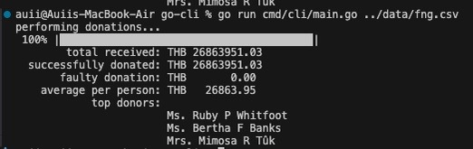
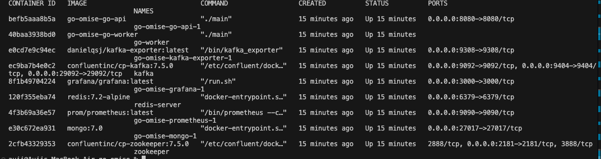
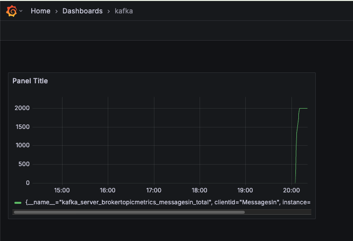

--

## 📐 Architecture Overview

1. **Go-CLI**: Loads donation data from CSV files and publishes it to Kafka.
2. **Kafka**: Acts as the message broker, facilitating communication between services.
3. **Go-Worker**: Consumes messages from Kafka, processes donation data, and logs the results to MongoDB.
4. **MongoDB**: Stores processed donation data for logging and auditing purposes.
5. **Go-API**: Provides a REST API for submitting donation requests and interacting with the system.
6. **Redis**: Implements rate limiting to ensure fair usage of the API.

---

## 🚀 Getting Started

### Prerequisites

Ensure you have the following installed:
- [Go](https://golang.org/dl/) (version 1.18 or later)
- [Kafka](https://kafka.apache.org/quickstart)
- [MongoDB](https://www.mongodb.com/try/download/community)
- [Redis](https://redis.io/download)

Prometheus: http://localhost:9090

Grafana: http://localhost:3000

### Installation

1. Clone the repository:
   ```bash
   git clone https://github.com/your-username/go-tamboon.git
   cd go-tamboon
   ```

2. Install dependencies:
   ```bash
   go mod tidy
   ```

3. Set up environment variables:
   Create a `.env` file in the root directory and configure the following:
   ```env
   KAFKA_BROKER=localhost:9092
   MONGO_URI=mongodb://localhost:27017
   REDIS_ADDR=localhost:6379
   ```

### Monitoring with Prometheus and Grafana

1. Access Prometheus:
   - Open your browser and navigate to [http://localhost:9090](http://localhost:9090).
   - Use Prometheus to query metrics and monitor the system's performance.

2. Access Grafana:
   - Open your browser and navigate to [http://localhost:3000](http://localhost:3000).
   - Log in with the default credentials (`admin`/`admin`) and configure your data source to connect to Prometheus.
   - Import or create dashboards to visualize system metrics.

### Running the Project with Docker Compose

1. Start all services using Docker Compose:
   ```bash
   docker-compose up -d
   ```
2. Load sample donation data via the CLI:
   ```bash
   cd go-cli
   go run cmd/cli/main.go ../data/fng.csv
   ```

---
### Running the Project on local each project

1. Start Kafka, MongoDB, and Redis services.

2. Run the API server:
   ```bash
   cd go-api
   go run cmd/api/main.go
   ```

3. Run the worker:
   ```bash
   cd go-worker
   go run cmd/worker/main.go
   ```

4. Load sample donation data via the CLI:
   ```bash
   cd go-cli
   go run cmd/cli/main.go ../data/fng.csv 
   ```

## 🖼️ Screenshot







## 🧪 Testing

Run unit tests with coverage:
```bash
go test -coverprofile=coverage.out ./...
go tool cover -html=coverage.out
